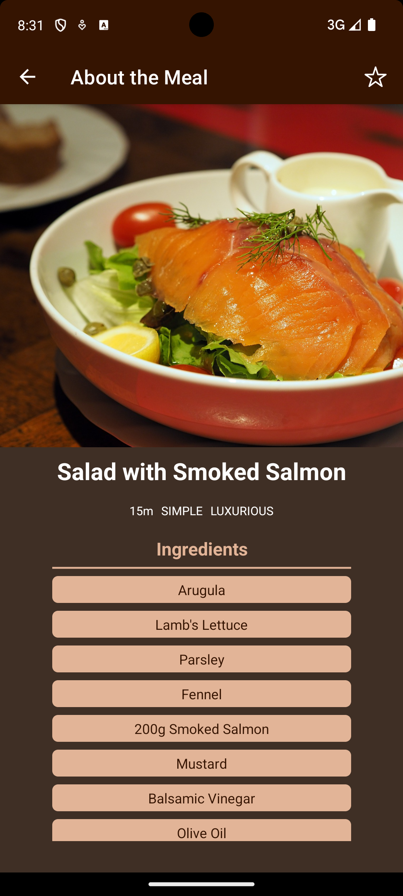

# React Native MealFinder App

Discover and enjoy delicious recipes with MealFinder. Built with React Native, MealFinder offers a user-friendly platform to explore recipes based on meal categories and manage your favorite dishes with ease.

## Features

- Category-Based Recipe: Easily find recipes by browsing through various meal categories such as Italian, Quick & Easy, German, Exotic & Asian.
- Favorite and Unfavorite Meals: Quickly mark recipes as favorites to save them for later or remove them from your favorites list with a single tap.
- Detailed Recipe Information: Access comprehensive recipe details including ingredients, step-by-step cooking instructions, and nutritional information.
- User-Friendly Interface: Enjoy a smooth and intuitive experience designed to make recipe discovery and meal planning effortless.

## Why Choose MealFinder?

- Simple and Intuitive: Navigate through the app with ease, thanks to its clean and straightforward design.
- Personalized Experience: Tailor your recipe collection by favoriting meals that you love and unfavoriting those that you don’t.
- Variety of Options: Explore a wide range of recipes across different meal categories to suit any time of day and any occasion.
- Convenient Meal Planning: Find inspiration for your next meal quickly, whether you’re planning a weekday dinner or a special occasion.

## Screenshots

- Android

1. All Categories Screen
   

2. Meal Overview Screen
   

3. Meal Details Screen
   

4. Meal Favorite Screen
   

5. Side Nav
   

- iOS

1. All Categories Screen
   

2. Meal Overview Screen
   

3. Meal Details Screen
   

4. Meal Favorite Screen
   

5. Side Nav
   

## Installation

Follow these steps to set up and run the app locally.

### Prerequisites

Ensure you have the following installed on your machine:

- [Node.js](https://nodejs.org/) (version 14 or higher)
- [npm](https://www.npmjs.com/) or [Yarn](https://yarnpkg.com/)
- [React Native CLI](https://reactnative.dev/docs/environment-setup)
- [Android Studio](https://developer.android.com/studio) (for Android development)
- [Xcode](https://developer.apple.com/xcode/) (for iOS development on macOS)

### Install Expo Globally

```sh
npm install -g expo-cli
```

### Steps

1. **Clone the repository:**

   ```sh
   git clone https://github.com/sayuj1/react-native-meal-finder-app.git
   cd react-native-meal-finder-app
   ```

2. **Install dependencies:**
   Using npm:

```sh
npm install
```

3. **Start the Metro bundler:**

```sh
npm start
```

4. **Run the app:**

- For Android:

Make sure you have an Android emulator running or an Android device connected via USB debugging.

```sh
Press a
```

- For iOS:

Make sure you have an iOS simulator running or an iOS device connected.

```sh
Press i
```

## Contributing

Contributions are welcome! Please fork the repository and submit a pull request.

## License

This project is licensed under the MIT License. See the LICENSE file for details.

## Contact

For any inquiries, please contact sayuj.sehgal@gmail.com
